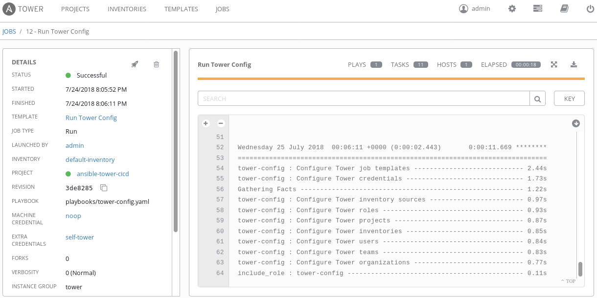

ansible-tower-cicd
==================

A framework for continuous integration and continuous delivery with Ansible Tower.

It installs Tower and uses Tower to update itself with this repository.

Disclaimer
==========

Please note that this community project is not officially supported by Red Hat.

What does it do ?
=================

This repository allows you to deploy Ansible Tower and manage it's resources
automatically through version controlled configuration.

After doing the initial bootstrap deployment, Ansible Tower will keep itself
up to date automatically by re-running the setup and configuration playbooks
against itself based on the latest code from this repository.

What is supported ?
===================

The following are currently supported and automated:

- Ansible Tower installation
- License activation (with `tower-cli <https://github.com/ansible/tower-cli>`_)
- `Organizations <https://docs.ansible.com/ansible/devel/modules/tower_organization_module.html>`_
- `Teams <https://docs.ansible.com/ansible/devel/modules/tower_team_module.html>`_
- `Users <https://docs.ansible.com/ansible/devel/modules/tower_user_module.html>`_
- `Roles <https://docs.ansible.com/ansible/devel/modules/tower_role_module.html>`_
- `Credentials <https://docs.ansible.com/ansible/devel/modules/tower_credential_module.html>`_
- `Projects <https://docs.ansible.com/ansible/devel/modules/tower_project_module.html>`_
- `Inventories <https://docs.ansible.com/ansible/devel/modules/tower_inventory_module.html>`_
- `Inventory sources <https://docs.ansible.com/ansible/devel/modules/tower_inventory_source_module.html>`_
- `Job templates <https://docs.ansible.com/ansible/devel/modules/tower_job_template_module.html>`_

Usage
=====

As necessary, supply your own configuration for the ``inventory.yaml`` file
as well as the ``tower-setup`` role and ``tower-config`` role.

If activating a license, make sure you have a license file at the specified path
for the ``tower-setup`` role (default: ``/root/tower-license.json``).

Install dependencies on CentOS or RHEL by running ``dependencies.sh`` and then
run::

    ansible-playbook playbooks/tower-setup.yaml
    ansible-playbook playbooks/tower-config.yaml

Known issues
============

- It is not possible to attach more than one credential to job templates: https://github.com/ansible/ansible/issues/43234

Contributors
============

See contributors on GitHub_.

.. _GitHub: https://github.com/dmsimard/ansible-tower-cicd/graphs/contributors

Copyright
=========

::

    Copyright (c) 2018 Red Hat, Inc.

    ansible-tower-cicd is free software: you can redistribute it and/or modify
    it under the terms of the GNU General Public License as published by
    the Free Software Foundation, either version 3 of the License, or
    (at your option) any later version.

    ansible-tower-cicd is distributed in the hope that it will be useful,
    but WITHOUT ANY WARRANTY; without even the implied warranty of
    MERCHANTABILITY or FITNESS FOR A PARTICULAR PURPOSE.  See the
    GNU General Public License for more details.

    You should have received a copy of the GNU General Public License
    along with ansible-tower-cicd.  If not, see <http://www.gnu.org/licenses/>.
